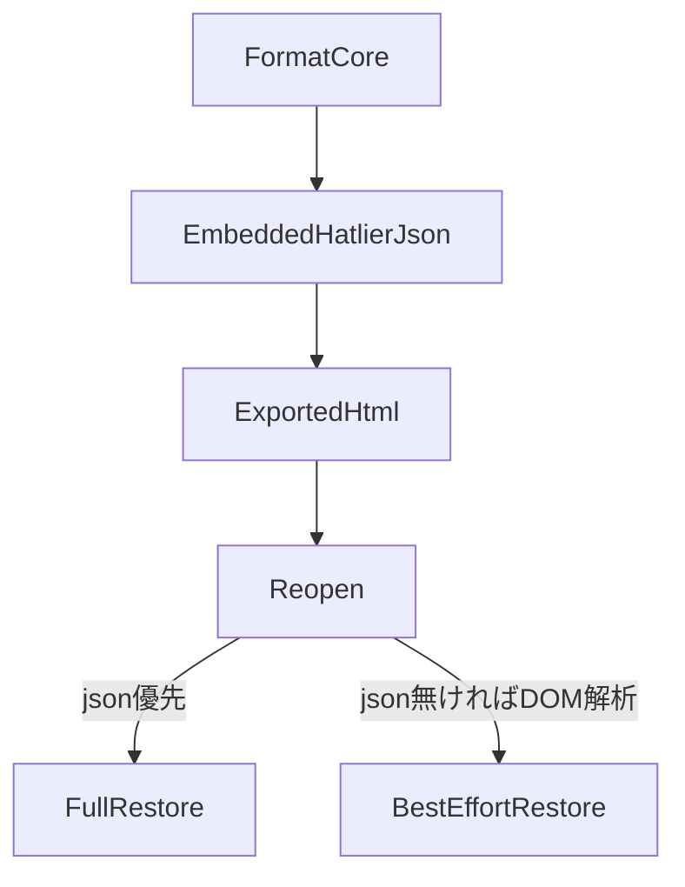

# Hatlier Format Core v1.0

> **ステータス:** 正式仕様（Core）— 2026-07-27  
> **位置づけ:** Hatlier の長期資産は実装詳細ではなく、本仕様が定義する **ラウンドトリップ保証付きフォーマット** にある。  
> **関連:** 製品方針は [`SPEC.md`](./SPEC.md)、機能ロードマップは [`ROADMAP.md`](./ROADMAP.md)、拡張議論メモは [`FORMAT-v2.md`](./FORMAT-v2.md)。  
> **実装状況:** エディタ [`hatlier.html`](./hatlier.html) **0.6.0** で `format` / `schema` 明示、未知部品の保持、`parse` / `migrate` / `renderDoc` / `roundTrip` API を実装。内部保存は当面 **flat 互換形**（`theme` + `blocks`）。Core 入れ子形は読取時に flatten。完全な入れ子書出は後続。

---

## 0. 目的

Hatlier は「HTML エディタ」であると同時に、**AI も人も壊さず再編集できる HTML フォーマット**を育てる。

Format Core が約束するのは次の3点だけである。

| 軸 | 意味 |
|---|---|
| **壊さない** | 開く → 編集 → 保存で、理解できない情報も含めて欠落させない |
| **再現できる** | 同じ schema / component version なら、見た目と意味を再構築できる |
| **将来抽象化できる** | 部品分類を増やしすぎず、共通骨格の上で何年でも部品を足せる |

部品カタログ（hero / tabs / map / …）は **Core の外**で育てる。Core は「どんな部品でも従う共通ルール」だけを固定する。

---

## 1. 不変条件（Invariants）

実装・migration・他エディタは、次を破ってはならない。

1. **すべての部品は一意の `id` を持つ**
2. **すべての部品は `kind` と `version`（部品 schema version）を持つ**
3. **意味（semantic）と再現性（appearance）と実データ（props）を分離して保存する**
4. **未知のキーは削除しない**（ラウンドトリップ保証）
5. **未知の部品でも再保存時に落とさない**（編集できなくても保持する）
6. **配布物は 1 HTML だが、フォーマットの正本は埋め込み Hatlier データである**
7. **HTML 手編集後も、構造情報を可能な限り再取得できる**（DOM fallback）
8. **破壊的変更は公開された migration で行う**（変換器を隠さない）
9. **自由座標・自由 px・重ね順の永続データは持たない**（レイアウトは枠と列挙のみ）
10. **文書級フィールドと部品級フィールドを混ぜない**

「編集できない」と「壊す」は別物である。旧エディタは新部品を編集できなくてよい。ただし再保存で消してはならない。

---

## 2. HTML と正本データの関係



| 層 | 役割 |
|---|---|
| **埋め込み JSON**（`#hatlier-doc`） | **正本**。編集・互換・migration のソース・オブ・トゥルース |
| **表示 DOM**（`.blk` 等） | 人が読む・配布する見た目。再編集のフォールバック |
| **同梱 CSS**（`#doc-style`） | 表示契約。自由 style 属性の増殖は禁止 |

### 読み込み優先順位

1. `script#hatlier-doc`（または旧 `atelier-doc`）の JSON を `parse` → `migrate`
2. 無ければ DOM から best-effort 復元（情報が欠ける場合がある）
3. Hatlier 構造と認められない場合はフリー編集（フォーマット外）

### 書き出し義務

- `<body class="doc" …>` と `<main class="page" …>` を持つ 1 HTML
- 正本 JSON を `#hatlier-doc` に同梱する（再編集第一級）
- `data-profile` / 構図属性など、表示に必要な列挙属性を DOM にも付ける（AI・手編集の手がかり）

HTML は **シリアライズ結果**である。フォーマットの意味は JSON 側に置く。

---

## 3. 文書モデル（Core Shape）

### 3.1 正規形（目標・schema 1）

```json
{
  "format": "hatlier",
  "schema": 1,
  "doc": {
    "id": "doc_…",
    "profile": "safe",
    "layout": {
      "shell": { "type": "stack", "ratio": "2-1", "side": "end" },
      "width": "default"
    },
    "appearance": {
      "theme": "paper",
      "bg": "plain",
      "font": "elegant",
      "cvd": "none"
    },
    "meta": {},
    "components": [
      {
        "id": "cmp_…",
        "kind": "hero",
        "version": 1,
        "region": "main",
        "semantic": { "variant": "display" },
        "appearance": { "space": "default" },
        "props": { "kicker": "…", "title": "…", "lede": "…" },
        "children": [],
        "meta": {},
        "unknown": {}
      }
    ]
  }
}
```

### 3.2 フィールド責務

#### 文書（`doc`）

| 領域 | キー例 | 責務 |
|---|---|---|
| `id` | `doc_…` | 文書の一意 ID（無くても可。付与を推奨） |
| `profile` | `safe` / `standard` / `rich` | 出力の向き（出口契約） |
| `layout` | `shell`, `width` | 構図・ページ幅。座標なし |
| `appearance` | `theme`, `bg`, `font`, `cvd` | 文書全体の見た目プリセット（列挙） |
| `meta` | 任意 | 作成元・タイトルヒント・注釈など |
| `components` | 配列 | 部品一覧（旧称 `blocks`） |

#### 部品（component）

| 領域 | 責務 | 入れてよいもの | 入れてはならないもの |
|---|---|---|---|
| `kind` | 種別 ID | `hero`, `text`, `image`, … | 自由文字列の見た目記述 |
| `version` | その kind の schema 版 | 正の整数 | 省略（正規化時は 1） |
| `region` | 載る枠 | `main` / `side`（shell に応じる） | px 座標 |
| `semantic` | **意味** | `variant`, `intent`, `role`, `priority` | raw CSS |
| `appearance` | **再現性** | `space`, `frame`, `align`, theme 参照 | 自由 px / z-index |
| `props` | **実データ** | 文言・items・URL・src | レイアウト座標 |
| `children` | 入れ子 | 将来のネスト部品 | — |
| `meta` | 編集補助 | AI 由来・注釈 | — |
| `unknown` | 保持袋 | 旧エディタが理解できないキー | 故意のゴミ箱設計に使わない |

### 3.3 意味 + 再現性 + 実データ

| 層 | 問い | 例 |
|---|---|---|
| **semantic** | 何のための部品か | `variant: "primary"`, `intent: "cta"` |
| **appearance** | 同じ版でどう見えるか | `space: "roomy"`, `frame: "half"` |
| **props** | 中身は何か | `title`, `items`, `src` |

- 意味だけ → テーマ変更で見た目が破綻しうる  
- 見た目だけ → テーマ進化・AI 編集ができない  
- **両方 + props** が Core の答えである

`custom` や深い `category/type/option/派生` 階層は **Core に入れない**。分類は `kind` と部品カタログ側で足りる。足りなくなったら部品 `version` を上げて migration する。

---

## 4. 現行実装の棚卸し（v0 → Core 対応表）

`hatlier.html` 0.5.9 時点の保存形は **フラットな v0 文書**である。Core schema 1 への完全書き換えはまだ必須ではないが、対応関係を固定する。

### 4.1 文書級（現行 → Core）

| 現行キー | Core 配置 | 備考 |
|---|---|---|
| （なし / 暗黙） | `format: "hatlier"`, `schema: 1` | 書出時に明示する目標 |
| `theme` | `doc.appearance.theme` | 列挙 |
| `bg` | `doc.appearance.bg` | 列挙＋モチーフ ID |
| `font` | `doc.appearance.font` | 列挙 |
| `cvd` | `doc.appearance.cvd` | `none` / CVD 近似 |
| `profile` | `doc.profile` | `safe` 既定 |
| `width` | `doc.layout.width` | `default` / `wide` / `full` |
| `shell` | `doc.layout.shell` | `type` / `ratio` / `side` |
| `blocks` | `doc.components` | 配列。順序＋`region` |

### 4.2 部品級（現行 → Core）

| 現行キー | Core 配置 | 備考 |
|---|---|---|
| `id` | `id` | 必須 |
| `type` | `kind` | リネーム予定。読取は両方受理 |
| （なし） | `version` | 現状は暗黙 1 |
| `region` | `region` | `main` / `side`。`stack` 時は `main` |
| `props.space` | `appearance.space` | 全部品共通候補 |
| `props.variant` | `semantic.variant` | 部品 allowlist |
| `props.frame` / `align` | `appearance.frame` / `align` | 画像・動画 |
| その他 `props.*` | `props.*` | 実データ |
| 未知キー | `unknown` または props 内保持 | 落とさない |

### 4.3 現行 `kind`（REG）一覧

エディタが知る部品（2026-07-27）:

`hero`, `text`, `cols`, `stats`, `steps`, `table`, `chart`, `todo`, `toggle`, `callout`, `faq`, `timeline`, `badges`, `button`, `divider`, `quote`, `code`, `linkcard`, `image`, `video`, `pdf`, `closing`, `carousel`, `tabs`, `calendar`, `gantt`, `clock`, `audio`, `qr`, `barcode`, `pagesearch`, `langs`

未知の `kind` は **レジストリに無くても保持**する（§5）。

### 4.4 現行共通オプション（列挙）

| キー | 許可値 | 既定 |
|---|---|---|
| `space` | `default` / `tight` / `roomy` | `default` |
| `shell.type` | `stack` / `split` | `stack` |
| `shell.ratio` | `2-1` / `1-1` / `1-2` | `2-1` |
| `shell.side` | `end` / `start` | `end` |
| `width` | `default` / `wide` / `full` | `default` |
| `profile` | `safe` / `standard` / `rich` | `safe` |
| `frame` | `full` / `wide` / `half` / `third` | `full` |
| `align` | `start` / `center` / `end` | `center` |

未知の列挙値は **表示時フォールバック**し、可能なら **保存値は触らない**（FORMAT-v2 R2 / R6 と同旨）。

### 4.5 互換ミラー（移行期間）

移行中は次を許可する。

- 書出 JSON に **現行フラット形**（`theme` + `blocks`）を書いてよい  
- Core 形を書く場合、旧リーダー向けに `blocks` ＝ `components` のミラーを併記してよい  
- 読取はフラット形・Core 形の両方を `migrate` で内部最新へ昇格する

---

## 5. 互換ポリシー

### 5.1 バージョンの二層

| 識別子 | 単位 | 役割 |
|---|---|---|
| `schema` | 文書全体 | 文書骨格（layout / appearance 配置など）の版 |
| `component.version` | 各部品 | その `kind` の props/semantic 形の版 |
| `HATLIER_VERSION` | エディタ実装 | UI・バグ修正の版。**フォーマット版とは別** |

エディタ版を上げても、必ずしも `schema` を上げない。破壊的な文書形変更のときだけ `schema` を上げる。

### 5.2 読み書きルール

| 操作 | 規則 |
|---|---|
| **読取** | 寛容。旧形は内部最新へ `migrate`。未知キー・未知部品は保持 |
| **表示** | 未知部品はプレースホルダ（「この版では未対応」）。データは残す |
| **保存** | 原則、実装が知る最新 `schema` で書く。未知情報は落とさない |
| **削除** | ユーザ操作または明示確認のあるプロファイル切替のみ |

### 5.3 Unknown preservation（最重要）

1. JSON に存在する未知の文書キーは、再保存で消さない  
2. 未知の `kind` は `components` に残す（描画スキップ可）  
3. 既知 `kind` の未知 props / semantic / appearance キーは残す  
4. DOM だけから復元した場合、欠落しうる情報があることを許容する（best-effort）  
5. `unknown` オブジェクトへ退避してよいが、**意図的な拡張の置き場にしない**（正式キーは版上げで定義する）

これがあるだけで、新しい Hatlier が書いたファイルを古い Hatlier が開いても **壊さず再保存**できる。後方互換より先に、この **前方のデータ保持**を契約する。

### 5.4 Migration 規則

- migration は **純関数**（同じ入力 → 同じ出力）
- 連鎖可能: `1→2`, `2→3`, … を合成して `1→N`
- **すべて公開**する（リポジトリ内。将来は `hatlier-spec` / 変換ライブラリへ切り出し可）
- ユーザが特定 schema に留めたい場合に備え、変換器は OSS として残す
- 破壊的変更（キー削除・意味変更）は必ず migration エントリと `schema` / `component.version` の引き上げを伴う

### 5.5 DOM fallback

| 情報 | JSON | DOM only |
|---|---|---|
| 部品 type / 文言 | 完全 | `.blk` + class から best-effort |
| `region` | 完全 | `data-region` 祖先から |
| `shell` | 完全 | `data-shell` / `data-ratio` / `data-side` |
| 未知 props | 保持 | **失われうる** |
| `meta` / `unknown` | 保持 | **失われうる** |

したがって「手で HTML をいじったあと」も開けるが、**完全性の保証は JSON 正本側**にある。

### 5.6 プロファイルとの関係

- `profile` は **出口契約**（どの部品・needs を許すか）
- 厳しくするとき、非対応部品は **確認のうえ削除**してよい（ユーザ同意）
- 確認なしの黙殺削除は禁止

---

## 6. 最小 API 契約

将来のライブラリ／CLI／エディタ内部が共有する最小面。言語は TypeScript 擬似。実装言語は問わない。

```ts
/** 正本文書（migrate 後の内部形を含む） */
type HatlierDoc = {
  format: "hatlier";
  schema: number;
  doc: {
    id?: string;
    profile: string;
    layout: Record<string, unknown>;
    appearance: Record<string, unknown>;
    meta?: Record<string, unknown>;
    components: HatlierComponent[];
    /** 移行用ミラー等、未知キー許可 */
    [k: string]: unknown;
  };
  [k: string]: unknown;
};

type HatlierComponent = {
  id: string;
  kind: string;
  version: number;
  region?: string;
  semantic?: Record<string, unknown>;
  appearance?: Record<string, unknown>;
  props?: Record<string, unknown>;
  children?: HatlierComponent[];
  meta?: Record<string, unknown>;
  unknown?: Record<string, unknown>;
  [k: string]: unknown;
};

/** HTML 文字列 → 文書。JSON 優先、なければ DOM。失敗時は null / エラー */
function parse(html: string): HatlierDoc | null;

/** 文書を targetSchema へ変換。未知情報を落とさない */
function migrate(doc: HatlierDoc, targetSchema: number): HatlierDoc;

/** 文書 → 配布用 1 HTML（#hatlier-doc 同梱） */
function render(doc: HatlierDoc, opts?: { profile?: string }): string;

/**
 * 開いて書き戻す。情報欠落がないことを検証するときに使う。
 * 期待: parse(render(parse(html))) が意味的に同型（正規化差は許容表で定義）
 */
function roundTrip(html: string): string;
```

### 6.1 セマンティクス

| API | 必須動作 |
|---|---|
| `parse` | `#hatlier-doc` を優先。旧 flat JSON も受理し、必要なら内部で Core 形へ寄せる |
| `migrate` | schema を単調に上げる。未知キー保持。冪等（同 schema なら実質 no-op） |
| `render` | 表示 HTML + 正本 JSON。自由座標を出力しない |
| `roundTrip` | `render(migrate(parse(html), CURRENT))` と等価でよい |

### 6.2 現行エディタとの対応（暫定）

| Core API | 現行 `hatlier.html` |
|---|---|
| `parse` | `parseHatlierJson` / `parseDom` / `classifyHTML` |
| `migrate` | `migrate(d)`（flat 形の正規化） |
| `render` | `buildBlocksHTML()` |
| `roundTrip` | selftest の export↔parse |

Core 形への内部統一は、上記関数を薄い互換ラッパで包み替えていく。

### 6.3 検証（最低ライン）

次を自動テスト（selftest / 将来の format テスト）の対象にする。

1. 既知文書の `roundTrip` で blocks/components 数が一致  
2. 未知 `kind` を含む JSON を開いて保存しても当該部品が残る  
3. 未知 props キーが残る  
4. `schema` 上げ migration が公開パスで辿れる  
5. `stack` / `split` の region が欠落しない  

---

## 7. レイアウト契約（Core に属する範囲）

詳細の部品候補は FORMAT-v2 に残すが、Core として固定するのは次のみ。

- レイアウトは **少数の shell** と **region 内の縦積み** のみ  
- 許可: 列挙オプション（`variant` / `frame` / `space` / `ratio` …）  
- 禁止: 絶対座標、自由 px の永続化、重ね順ドラッグの永続データ  
- すべての shell はモバイルで情報が欠けない折りルールを持つ  

現行 shell:

| type | デスクトップ | モバイル |
|---|---|---|
| `stack` | 1 列 | 同じ |
| `split` | main + side（比は列挙） | side は下へ縦折り |

---

## 8. プロファイル（出口）との境界

Format Core は **形の契約**。プロファイルは **どの能力を許すか**。

- Core: どう保存し、どう壊さないか  
- Profile: `needs`（例: `js`）に応じてパレットと実行を制限するか  

両者を混同しない。`safe` でも Core の unknown preservation は守る。

---

## 9. リポジトリ戦略

1. **いま:** 本ファイルを atelier 内の Format Core 正本とする  
2. **次:** 現行 flat JSON の棚卸しに沿って `migrate` / 書出を段階対応  
3. **その後:** `schemas/`（JSON Schema）と `migration/`（vN→vN+1）を同梱または独立 `hatlier-spec` へ  

GUI・テーマ・部品追加は、本 Core を破らない限り自由に進められる。

---

## 10. マネタイズとの関係（方針メモ）

Format Core が公開資産であることと、収益は両立する。

| 公開（OSS） | 有償候補 |
|---|---|
| 本仕様・migration・基本エディタ | 企業向け LTS / 長期互換保証 |
| 変換器・検証の基本 | 監査・CI・サポート |
| コミュニティ examples | 公式 theme / テンプレ pack |

売るものは「多機能 GUI」より **安心して年単位で使えるフォーマット運用**である。

---

## 11. やらないこと（Core 境界）

- 最初から巨大な category / type / option / 派生 / custom 階層を正規化すること  
- `custom` を仕様の逃げ道にすること  
- 意味だけ、または CSS だけを正本にすること  
- フォーマット版とエディタ版を同一視すること  
- JSON 無しの「きれいな HTML だけ」を唯一の正本にすること（配布は HTML、互換の正本は埋め込みデータ）

---

## 12. 変更履歴

| 日付 | 内容 |
|---|---|
| 2026-07-27 | Format Core v1.0 初版。不変条件、正本/HTML 関係、shape、現行対応表、互換ポリシー、最小 API を固定 |
| 2026-07-27 | 0.6.0 で schema 明示・未知保持・API を実装。flat 書出＋入れ子読取 |

---

## 付録 A — 最小 example（flat 現行形・受理必須）

```json
{
  "theme": "paper",
  "bg": "plain",
  "font": "elegant",
  "profile": "safe",
  "width": "default",
  "shell": { "type": "stack", "ratio": "2-1", "side": "end" },
  "blocks": [
    {
      "id": "b1",
      "type": "hero",
      "region": "main",
      "props": {
        "variant": "display",
        "space": "default",
        "kicker": "HELLO",
        "title": "Title",
        "lede": "Lead"
      }
    }
  ]
}
```

## 付録 B — 最小 example（Core schema 1 目標形）

```json
{
  "format": "hatlier",
  "schema": 1,
  "doc": {
    "profile": "safe",
    "layout": {
      "shell": { "type": "stack", "ratio": "2-1", "side": "end" },
      "width": "default"
    },
    "appearance": {
      "theme": "paper",
      "bg": "plain",
      "font": "elegant",
      "cvd": "none"
    },
    "components": [
      {
        "id": "b1",
        "kind": "hero",
        "version": 1,
        "region": "main",
        "semantic": { "variant": "display" },
        "appearance": { "space": "default" },
        "props": {
          "kicker": "HELLO",
          "title": "Title",
          "lede": "Lead"
        }
      }
    ]
  }
}
```
